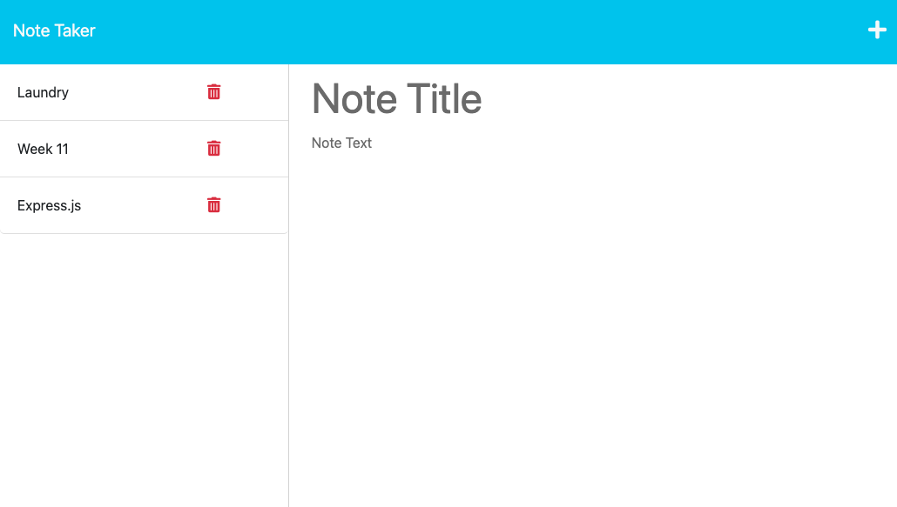

<h1 align='center'>Note Taker Application</h1>

## License


---

## Description

> Note Taker is an application designed for a user to write, save and delete notes. It uses Express.js for the back end so the user's notes are able to be saved a retrieved from a JSON file.

## Table of Contents

- [License](#license)
- [User Story](#user-story)
- [Acceptance Criteria](#acceptance-criteria)
- [Demonstration](#demostration)
- [Contact](#contact)

---

## User Story

```md
AS A small business owner
I WANT to be able to write and save notes
SO THAT I can organize my thoughts and keep track of tasks I need to complete
```

## Acceptance Criteria

```md
GIVEN a note-taking application
WHEN I open the Note Taker
THEN I am presented with a landing page with a link to a notes page
WHEN I click on the link to the notes page
THEN I am presented with a page with existing notes listed in the left-hand column, plus empty fields to enter a new note title and the note’s text in the right-hand column
WHEN I enter a new note title and the note’s text
THEN a Save icon appears in the navigation at the top of the page
WHEN I click on the Save icon
THEN the new note I have entered is saved and appears in the left-hand column with the other existing notes
WHEN I click on an existing note in the list in the left-hand column
THEN that note appears in the right-hand column
WHEN I click on the Write icon in the navigation at the top of the page
THEN I am presented with empty fields to enter a new note title and the note’s text in the right-hand column
```

---

## Demonstration

Below is a link to a walkthrough video showing the application functioning as intended.

[Note Taker Express Walkthrough Video](https://drive.google.com/file/d/1x-_er6NycxwboYvdlgTNhEhsnUHiEdpZ/view)

Below is a screenshot of the application

---



---

## Contact

[Github Repo](https://github.com/Klgibsonjr/note-taker-express-js)
